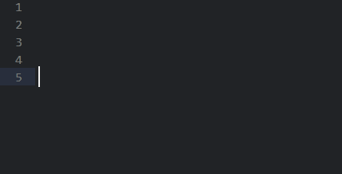
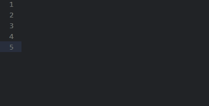
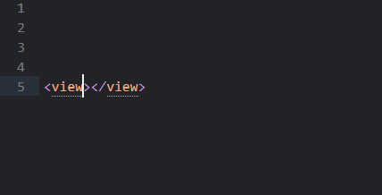

# Sublime-wxapp-fix
### 原项目为 [Sublime-wxapp](https://github.com/springlong/Sublime-wxapp)   
### 修复了我在使用中出现的几个小问题   
#### 1.修复自动补全template标签时会多出一个"<"   
修复前:
   
修复后:

#### 2.修复高亮错误   
修复前:
   
修复后:

#### 3.去除js补全中的"."
去除前:
   
去除后:

